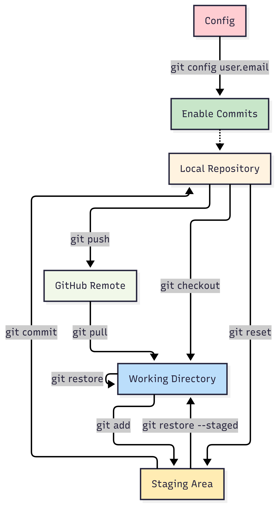

# 📚 Complete Git & GitHub Workflow Guide



## 🏁 Prerequisites

- Git installed on your machine
- GitHub account
- Terminal/Git Bash

---

## 📋 Table of Contents
1. [Initial Setup](#-initial-setup)
2. [Creating Repository](#-creating-repository)
3. [Basic Workflow](#-basic-workflow)
4. [Branching](#-branching)
5. [Advanced Operations](#-advanced-operations)
6. [Troubleshooting](#-troubleshooting)

---

## ⚙️ Initial Setup

### Configure Git Identity
```bash
# Set global username and email
git config --global user.name "Your Name"
git config --global user.email "your.email@example.com"

# Verify configuration
git config --list
```

### Useful Aliases (Optional)
```bash
git config --global alias.co checkout
git config --global alias.br branch
git config --global alias.ci commit
git config --global alias.st status
git config --global alias.unstage 'restore --staged --'
```

---

## 📂 Creating Repository

### 1. Create Local Directory
```bash
# Create project directory
mkdir my-project
cd my-project

# Initialize Git repository
git init
```

### 2. Create Files
```bash
# Create sample files
echo "# My Project" > README.md
echo "print('Hello World')" > main.py
```

### 3. Create GitHub Repository
1. Go to [GitHub](https://github.com)
2. Click "New repository"
3. Name it "my-project" (same as local folder)
4. **Do NOT** initialize with README

### 4. Connect Local to Remote
```bash
# Add remote origin
git remote add origin https://github.com/your-username/my-project.git

# Verify remote
git remote -v
```

---

## 🔄 Basic Workflow

### 1. Check Status
```bash
git status
```

### 2. Stage Files
```bash
# Stage specific file
git add README.md

# Stage all files in current directory
git add .

# Stage all files (including subdirectories)
git add -A

# Stage only modified files (no new files)
git add -u
```

### 3. View Staged Changes
```bash
git status
git diff --staged
```

### 4. Commit Changes
```bash
# Basic commit
git commit -m "Initial commit"

# Commit with description
git commit -m "Add main program" -m "Added main.py with hello world functionality"
```

### 5. Push to GitHub
```bash
# First push (set upstream)
git push -u origin main

# Subsequent pushes
git push
```

### 6. Pull Changes
```bash
# Pull latest changes
git pull

# Pull from specific branch
git pull origin main
```

---

## 🌿 Branching

### Create New Branch
```bash
# Create and switch to new branch
git checkout -b feature/new-feature

# Alternative (newer syntax)
git switch -c feature/new-feature
```

### Switch Between Branches
```bash
# Switch to existing branch
git checkout main
git switch main

# List all branches
git branch          # Local branches
git branch -a       # All branches (including remote)
```

### Merge Branches
```bash
# Switch to target branch
git checkout main

# Merge feature branch
git merge feature/new-feature
```

### Delete Branch
```bash
# Delete local branch
git branch -d feature/new-feature

# Force delete (if not fully merged)
git branch -D feature/new-feature

# Delete remote branch
git push origin --delete feature/new-feature
```

---

## ⏪ Rollback & Reset

### Undo Unstaged Changes
```bash
# Discard changes in specific file
git restore filename.py

# Discard all changes in working directory
git restore .
```

### Unstage Files
```bash
# Unstage specific file
git restore --staged filename.py

# Unstage all files
git restore --staged .
```

### Undo Commits
```bash
# Soft reset (keep changes staged)
git reset --soft HEAD~1

# Mixed reset (keep changes unstaged) - DEFAULT
git reset --mixed HEAD~1

# Hard reset (discard everything)
git reset --hard HEAD~1

# Reset to specific commit
git reset --hard a1b2c3d
```

### Revert Commit (Safe for shared history)
```bash
# Create new commit that undoes changes
git revert HEAD
git revert a1b2c3d
```

---

## 📊 Status & Log

### View Status
```bash
git status          # Detailed status
git status -s       # Short status
```

### View History
```bash
git log                     # Full history
git log --oneline           # Compact history
git log --oneline --graph   # Visual history
git log -5                  # Last 5 commits
```

### View Differences
```bash
git diff                    # Unstaged changes
git diff --staged           # Staged changes
git diff HEAD               # All changes since last commit
```

---

## 🚀 Advanced Operations

### Stashing
```bash
# Save changes temporarily
git stash

# List stashes
git stash list

# Apply last stash
git stash pop

# Apply specific stash
git stash apply stash@{1}

# Clear all stashes
git stash clear
```

### Tagging
```bash
# Create lightweight tag
git tag v1.0

# Create annotated tag
git tag -a v1.0 -m "Version 1.0"

# Push tags to remote
git push origin --tags
```

### Ignoring Files
Create `.gitignore` file:
```
# Python
__pycache__/
*.pyc
*.pyo

# Environment variables
.env

# Logs
*.log

# OS files
.DS_Store
Thumbs.db
```

---

## 🆘 Troubleshooting

### Authentication Issues
```bash
# Use SSH instead of HTTPS
git remote set-url origin git@github.com:username/repo.git

# Configure credential helper
git config --global credential.helper store
```

### Recover Lost Commit
```bash
# Find lost commit
git reflog

# Recover from specific commit
git checkout -b recovered-branch a1b2c3d
```

### Force Push (Use with Caution!)
```bash
# Only use on personal branches
git push --force-with-lease
```

---

## 🎯 Quick Reference

### Daily Workflow
```bash
git status
git add .
git commit -m "Message"
git push
```

### Common Issues Fix
```bash
# Pull with rebase to avoid merge commits
git pull --rebase

# Reset to remote state
git fetch origin
git reset --hard origin/main
```

---

## 📖 Best Practices

1. **Commit Often**: Small, focused commits
2. **Write Good Messages**: Use conventional commits
3. **Pull Before Push**: Avoid conflicts
4. **Use Branches**: Keep main branch stable
5. **Review Changes**: Use `git diff` before committing

Example commit message:
```
feat: add user authentication

- Implement login functionality
- Add password validation
- Create user database model
```

---

## 🆓 Free Resources

- [Git Documentation](https://git-scm.com/doc)
- [GitHub Learning Lab](https://lab.github.com/)
- [Interactive Git Tutorial](https://learngitbranching.js.org/)

---

## ❓ Need Help?

```bash
# Get help for any command
git help <command>
git <command> --help

# Example
git help commit
git add --help
```

# 🔀 Git Merging Guide: How to Merge Versions/Branches

## 📋 Table of Contents
1. [Types of Merges](#-types-of-merges)
2. [Basic Merging](#-basic-merging)
3. [Merge Conflicts](#-merge-conflicts)
4. [Rebase vs Merge](#-rebase-vs-merge)
5. [Advanced Merging](#-advanced-merging)
6. [Best Practices](#-best-practices)

---

## 🔄 Types of Merges

### 1. **Fast-Forward Merge** (Linear History)
```bash
# When no diverged commits exist
# Git simply moves pointer forward
```

### 2. **3-Way Merge** (Creates Merge Commit)
```bash
# When branches have diverged
# Creates a new merge commit
```

### 3. **Squash Merge** (Single Commit)
```bash
# Combines all feature commits into one
# Clean history but loses individual commits
```

### 4. **Rebase** (Linear History)
```bash
# Rewrites history, not technically a merge
# Creates linear progression
```

---

## 🧩 Basic Merging

### Merge Feature Branch into Main
```bash
# Step 1: Switch to target branch (where you want to merge INTO)
git checkout main
git switch main

# Step 2: Pull latest changes
git pull origin main

# Step 3: Merge feature branch
git merge feature/new-feature

# Step 4: Push the merge
git push origin main
```

### Check Merge Status
```bash
# See what will be merged
git log --oneline --graph --all

# Check differences between branches
git diff main..feature/new-feature
```

### Abort a Merge
```bash
# If merge goes wrong
git merge --abort
```

---

## ⚔️ Merge Conflicts

### When Conflicts Occur
```bash
# Git will show conflict message
Auto-merging README.md
CONFLICT (content): Merge conflict in README.md
Automatic merge failed; fix conflicts and then commit the result.
```

### Resolve Conflicts

#### 1. **Identify Conflicts**
```bash
git status
# Shows files with conflicts: both modified
```

#### 2. **Edit Conflicted Files**
Example conflicted file:
```markdown
<<<<<<< HEAD
This is content from main branch
=======
This is content from feature branch
>>>>>>> feature/new-feature
```

#### 3. **Resolve Manually**
Edit to keep what you want:
```markdown
This is resolved content from both branches
```

#### 4. **Mark as Resolved**
```bash
# Add resolved files
git add README.md

# Complete the merge
git commit
```

### Use Merge Tools
```bash
# Configure merge tool (VS Code)
git config --global merge.tool vscode
git config --global mergetool.vscode.cmd 'code --wait $MERGED'

# Launch merge tool
git mergetool
```

---

## 🔀 Rebase vs Merge

### Merge (Preserves History)
```bash
# Creates merge commit showing branch integration
git checkout main
git merge feature/branch
```

### Rebase (Clean History)
```bash
# Puts feature commits on top of main
git checkout feature/branch
git rebase main

# Then fast-forward merge
git checkout main
git merge feature/branch
```

### Interactive Rebase
```bash
# Rewrite commit history
git rebase -i HEAD~3

# Options: pick, reword, edit, squash, fixup, drop
```

---

## 🎯 Advanced Merging

### Squash Merge (Single Commit)
```bash
# Merge and squash all commits into one
git checkout main
git merge --squash feature/branch
git commit -m "Squashed feature implementation"
```

### Merge Specific Files
```bash
# Checkout file from another branch
git checkout feature/branch -- specific-file.py
```

### Cherry-Pick Commits
```bash
# Apply specific commit to current branch
git cherry-pick a1b2c3d

# Cherry-pick range
git cherry-pick start-commit^..end-commit
```

### Partial Merge (Theirs/Ours)
```bash
# Keep changes from current branch
git merge -s ours feature/branch

# Keep changes from other branch
git merge -s theirs feature/branch
```

---

## 📊 Merge Strategies

### Recursive Strategy (Default)
```bash
git merge -s recursive feature/branch
```

### Octopus Strategy (Multiple Branches)
```bash
# Merge multiple branches at once
git merge branch1 branch2 branch3
```

### Ours Strategy (Ignore Other Changes)
```bash
# Keep our version in conflicts
git merge -s ours feature/branch
```

---

## 🛠️ Practical Examples

### Example 1: Standard Feature Merge
```bash
# Develop feature
git checkout -b feature/login
# ... make changes ...
git add .
git commit -m "Add login functionality"

# Merge to main
git checkout main
git pull origin main
git merge feature/login
git push origin main

# Clean up
git branch -d feature/login
```

### Example 2: Handling Conflicts
```bash
# Merge causes conflict
git merge feature/conflicting

# Resolve conflicts in files
# Edit files, remove conflict markers

git add .
git commit -m "Resolve merge conflicts"
git push
```

### Example 3: Rebase Workflow
```bash
# Keep feature branch updated
git checkout feature/branch
git fetch origin
git rebase origin/main

# Resolve any conflicts during rebase
git add .
git rebase --continue

# Merge with fast-forward
git checkout main
git merge feature/branch
```

---

## 📝 Best Practices

### Before Merging
1. **Pull latest changes**: `git pull origin main`
2. **Run tests**: Ensure code works
3. **Check status**: `git status` and `git diff`
4. **Communicate**: Let team know you're merging

### During Merging
1. **Resolve conflicts carefully**
2. **Test after resolving conflicts**
3. **Write meaningful merge messages**

### After Merging
1. **Push promptly**: `git push origin main`
2. **Delete merged branches**: `git branch -d feature/branch`
3. **Verify deployment**: Check everything works

### Conflict Resolution Tips
```bash
# Use diff tools
git difftool

# See changes from each branch
git show :1:file.txt   # Common ancestor
git show :2:file.txt   # Our version
git show :3:file.txt   # Their version
```

---

## 🚨 Common Issues & Solutions

### Merge Aborted Due to Conflicts
```bash
# Start over
git merge --abort
git reset --hard
git clean -fd
```

### Wrong Merge - Revert
```bash
# Revert a merge commit
git revert -m 1 MERGE_COMMIT_HASH
```

### Merge Too Many Changes
```bash
# Reset and merge selectively
git reset --hard HEAD~1
git merge --no-commit feature/branch
git reset HEAD    # Unstage everything
git add specific-files   # Add only what you want
git commit
```

---

## 🎪 Visual Tools

### View Merge History
```bash
git log --oneline --graph --all
git log --merges   # Show only merge commits
```

### GUI Tools
```bash
gitk                 # Built-in GUI
git mergetool        # Configured merge tool
code .               # VS Code merge resolution
```

---

## ✅ Verification Commands

```bash
# Verify merge result
git log --oneline -5
git status

# Check what was merged
git diff HEAD~1..HEAD

# Verify remote status
git fetch origin
git status
```

---

## 🆘 Emergency Recovery

### Undo Bad Merge
```bash
# Reset to before merge
git reset --hard HEAD~1

# Or revert the merge
git revert -m 1 MERGE_COMMIT_HASH
```

### Recover Lost Branch After Merge
```bash
# Find the branch tip
git reflog

# Restore branch
git branch feature/lost-branch OLD_HASH
```

**Remember**: Merging is about bringing work together. Choose the strategy that fits your team's workflow! 🚀